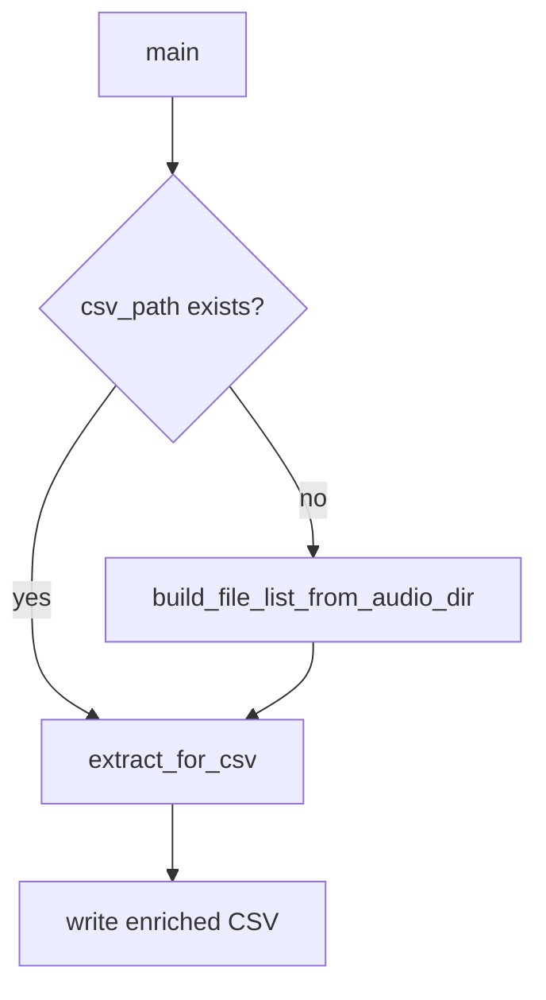

# Auto-build file-list CSV when missing

## Current behavior

[`extract_m4a_creation_times.py`](c:\Users\pho\repos\EmotivEpoc\ACTIVE_DEV\whisper-timestamped\scripts\iOSWhisperAppHelpers\extract_m4a_creation_times.py) exits if the CSV is absent:

```313:314:scripts/iOSWhisperAppHelpers/extract_m4a_creation_times.py
    if not csv_path.is_file():
        raise SystemExit(f"CSV not found: {csv_path}")
```

Existing file lists use this schema (from `H:\...\filelists\*_m4a_file_list.csv`):

`name`, `size_bytes`, `size_mb`, `creation_time`, `modification_time`, `full_path`

## Change

In the same script only:

1. **Add `build_file_list_from_audio_dir(audio_dir, csv_path, tz_name) -> int`**
   - Require `audio_dir` is a directory; else `SystemExit`.
   - Collect `sorted(audio_dir.glob("*.m4a"))` (files only).
   - If none found, `SystemExit` with a clear message.
   - Per file: `name`, `size_bytes` from `stat().st_size`, `size_mb` as `size_bytes / 1_048_576` formatted to 3 decimals (matches existing CSVs), `creation_time` / `modification_time` as `YYYY-MM-DD HH:MM:SS` in `--tz` from Windows birth time (`st_ctime` on win32; `st_birthtime` when available else `st_ctime` elsewhere) and `st_mtime`, `full_path` as `str(path.resolve())` or `str(path)` consistent with existing `H:\...` rows.
   - `csv_path.parent.mkdir(parents=True, exist_ok=True)` then `df.to_csv(..., index=False, encoding="utf-8")`.
   - Print how many rows were written; return the count.

2. **Wire in `main()`**
   - Replace the hard exit with: if CSV missing → build from `args.audio_dir` into `csv_path`, then proceed into `extract_for_csv` unchanged (probe + enrich columns + optional SetFileTime).
   - Still fail if audio dir is bad / empty after attempting build.

3. **Docs**
   - One-line note in the module docstring / argparse description that a missing input CSV is created from `--audio-dir`.

No new CLI flags. Defaults already point at `DEFAULT_AUDIO_DIR` and `DEFAULT_CSV_PATH`.


