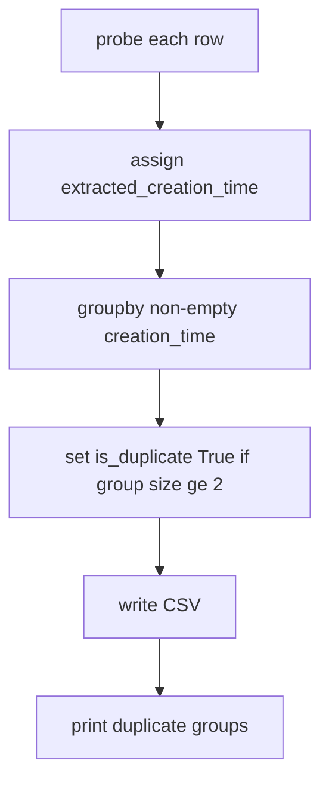

# Creation-time duplicate detection in extract CSV

## Scope

Only change [`extract_m4a_creation_times.py`](c:\Users\pho\repos\EmotivEpoc\ACTIVE_DEV\whisper-timestamped\scripts\iOSWhisperAppHelpers\extract_m4a_creation_times.py). This is **annotation only** (no deletes/renames)—unlike [`dedupe_m4a_exports.py`](c:\Users\pho\repos\EmotivEpoc\ACTIVE_DEV\whisper-timestamped\scripts\iOSWhisperAppHelpers\dedupe_m4a_exports.py), which groups by export-suffixed filenames.

Current data already shows the signal: 12 groups / 24 rows share identical `extracted_creation_time` (mostly `recovered_*` vs `recovered_recovered_*`).

## Behavior

1. **When**: After all rows are probed and `extracted_creation_time` is assigned, before `to_csv`.
2. **Key**: Exact string match on non-empty `extracted_creation_time` (second-precision local string already written). Empty / missing creation times are never treated as duplicates of each other.
3. **Flag**: Every row in a group with count ≥ 2 gets `is_duplicate=True`; all other rows get `False`.
4. **Column**: New constant `COL_IS_DUPLICATE = "is_duplicate"`; add/overwrite on the DataFrame like the other enrich columns.
5. **Print**: After writing the CSV (or just before the final summary), print each duplicate group in a style similar to `dedupe_m4a_exports`:
   - Header: group count + creation time
   - Per member: `name`, `size_bytes` (if present), duration if present
   - Final tally: `dup_groups=N dup_rows=M` folded into the existing `Done.` line



## Implementation sketch

Add a small helper used inside `extract_for_csv`:

```python
def mark_creation_time_duplicates(df: pd.DataFrame) -> Tuple[int, int]:
    """Set is_duplicate from extracted_creation_time; return (dup_groups, dup_rows)."""
    ct = df[COL_CREATION].fillna("").astype(str).str.strip()
    counts = ct.replace("", pd.NA).map(ct[ct != ""].value_counts())
    # or: value_counts then map; empty -> not duplicate
    is_dup = ct.ne("") & ct.map(ct.value_counts()).ge(2)
    df[COL_IS_DUPLICATE] = is_dup
    dup_groups = int(ct[is_dup].nunique())
    dup_rows = int(is_dup.sum())
    return dup_groups, dup_rows
```

Then `print_creation_time_duplicates(df)` iterates groups with size ≥ 2 (sorted by creation time) and prints members.

Wire into `extract_for_csv` return / `main` summary; mention `is_duplicate` in the module docstring and argparse description.

## Defaults chosen

- Column values: boolean `True`/`False` (pandas CSV writes `True`/`False`).
- All members of a colliding creation-time group are duplicates (no “keeper” selection).
- No new CLI flags.