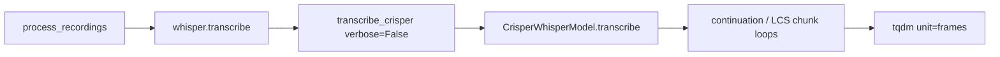

# CT2 / CrisperWhisper progress bars

## Goal
Match openai-whisper’s terminal look while CrisperWhisper runs (CT2 on WSL2 via [`process_recordings.py`](c:\Users\pho\repos\EmotivEpoc\ACTIVE_DEV\whisper-timestamped\scripts\process_recordings.py)):

```text
 45%|████████████████                    | 2720/6058 [00:12<00:14, 227.31frames/s]
```

OpenAI Whisper enables that bar when `verbose=False` (`disable=verbose is not False`). [`process_recordings.py`](c:\Users\pho\repos\EmotivEpoc\ACTIVE_DEV\whisper-timestamped\scripts\process_recordings.py) does not pass `verbose`, so it stays `False` — the bar should appear automatically once wired.

## Approach
Shared longform code path (CT2 and transformers both use it). Add a small helper and wrap every longform chunk loop; thread `verbose` from the adapter down into those loops.



## Implementation

### 1. Progress helper
Add [`whisper_timestamped/crisperwhisper/longform/progress.py`](c:\Users\pho\repos\EmotivEpoc\ACTIVE_DEV\whisper-timestamped\whisper_timestamped\crisperwhisper\longform\progress.py):

- `HOP_LENGTH = 160` (same as [`engine.py`](c:\Users\pho\repos\EmotivEpoc\ACTIVE_DEV\whisper-timestamped\whisper_timestamped\crisperwhisper\engine.py))
- `audio_progress_bar(audio, verbose=False)` context manager yielding a tqdm with:
  - `total = len(audio) // HOP_LENGTH`
  - `unit="frames"`
  - `disable=(verbose is not False)` — same rule as openai-whisper
- Helper `frame_pos(sample_index) -> int` and update-after-chunk using covered audio end: `min(len(audio), int(i * stride * SAMPLE_RATE) + len(chunk)) // HOP_LENGTH` so the bar advances through the file (not just chunk count)

`tqdm` is already available via `openai-whisper`; import it directly (no new pyproject dep required).

### 2. Wrap longform chunk loops
In each strategy that iterates chunks, open the progress bar around the loop and `update` after each chunk:

- [`continuation.py`](c:\Users\pho\repos\EmotivEpoc\ACTIVE_DEV\whisper-timestamped\whisper_timestamped\crisperwhisper\longform\continuation.py) — `continuation_transcribe`, `continuation_transcribe_with_word_timestamps`, `continuation_transcribe_dual` (**primary path** used by `process_recordings` via `word_timestamps=True`)
- [`chunked_lcs.py`](c:\Users\pho\repos\EmotivEpoc\ACTIVE_DEV\whisper-timestamped\whisper_timestamped\crisperwhisper\longform\chunked_lcs.py)
- [`token_lcs.py`](c:\Users\pho\repos\EmotivEpoc\ACTIVE_DEV\whisper-timestamped\whisper_timestamped\crisperwhisper\longform\token_lcs.py)

Add `verbose: bool = False` to each of those function signatures.

### 3. Thread `verbose` from the public API
- [`crisper_backend.transcribe_crisper`](c:\Users\pho\repos\EmotivEpoc\ACTIVE_DEV\whisper-timestamped\whisper_timestamped\crisper_backend.py): pass `verbose=verbose` into `model.model.transcribe(...)`
- [`CrisperWhisperModel.transcribe` / `_transcribe_v2`](c:\Users\pho\repos\EmotivEpoc\ACTIVE_DEV\whisper-timestamped\whisper_timestamped\crisperwhisper\model.py): accept `verbose: bool = False` and forward it to the chosen longform strategy kwargs
- Keep existing `verbose` text-print behavior in the adapter (print final text when `verbose=True`); when `verbose=True` the bar is disabled (openai-whisper semantics)

No change required in `process_recordings.py` — default `verbose=False` will show the bar on a TTY.

## Out of scope
- Per-token decode bars inside CT2 C++ (not exposed)
- File-level batch progress across many recordings (script already prints `Processing: …`)
