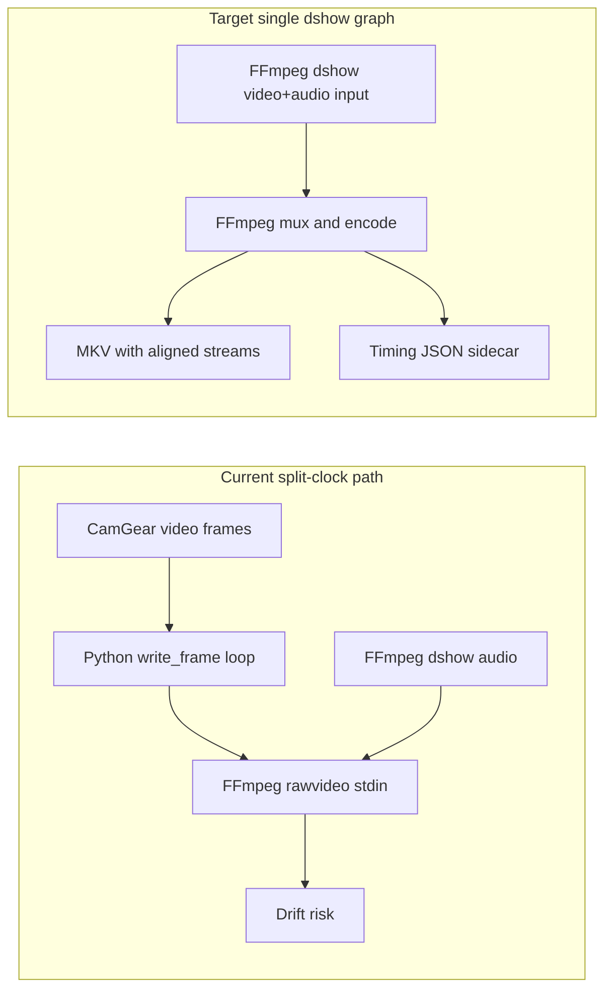

# DirectShow synchronized A/V capture with timing sidecars

## Goal

Implement the timestamp-safe path you chose: a single FFmpeg DirectShow input that captures camera video and microphone audio together:

```powershell
-f dshow -framerate 30 -video_size 640x480 -i video="HD Pro Webcam C920":audio="Microphone (HD Pro Webcam C920)"
```

This avoids the current split-clock pipeline in [src/recorder.py](C:/Users/pho/repos/EmotivEpoc/ACTIVE_DEV/continuous_video_recorder/src/recorder.py), where Python feeds video frames through stdin while FFmpeg separately captures audio.



## Scope

- Apply this first to [examples/debut_example.py](C:/Users/pho/repos/EmotivEpoc/ACTIVE_DEV/continuous_video_recorder/examples/debut_example.py), which is the retroactive/transcription-relevant continuous capture path.
- Keep the existing `VideoRecorder.write_frame()` backend for [main.py](C:/Users/pho/repos/EmotivEpoc/ACTIVE_DEV/continuous_video_recorder/main.py) and [src/usb_continuous_recorder.py](C:/Users/pho/repos/EmotivEpoc/ACTIVE_DEV/continuous_video_recorder/src/usb_continuous_recorder.py), because those modes need OpenCV frames for detection, preview, reconnect handling, or custom frame loops.
- Do not keep `CameraManager` open while DirectShow FFmpeg records; FFmpeg must own the camera device.

## Implementation Plan

### 1. Add DirectShow device resolution helpers

Extend [src/audio_device.py](C:/Users/pho/repos/EmotivEpoc/ACTIVE_DEV/continuous_video_recorder/src/audio_device.py) or add [src/dshow_devices.py](C:/Users/pho/repos/EmotivEpoc/ACTIVE_DEV/continuous_video_recorder/src/dshow_devices.py):

- List DirectShow video devices from `ffmpeg -list_devices true -f dshow -i dummy`.
- Reuse/extend audio device resolution.
- Resolve configured camera name from `webcam.camera_0.name` to the exact dshow video name.
- Resolve configured mic from `storage.audio_device` to the exact dshow audio name.

### 2. Add `DirectShowAVRecorder`

Create [src/dshow_recorder.py](C:/Users/pho/repos/EmotivEpoc/ACTIVE_DEV/continuous_video_recorder/src/dshow_recorder.py) with a small recorder class that mirrors the lifecycle API used by the example:

- `start_recording() -> Optional[Path]`
- `stop_recording() -> Optional[Path]`
- `is_recording() -> bool`
- `get_duration() -> float`
- `get_current_file() -> Optional[Path]`
- `should_split() -> bool`
- `split_recording() -> Optional[Path]`

Internally it will use `subprocess.Popen` for a non-blocking FFmpeg process rather than `WriteGear.write(frame)`. This gives us reliable stop/split control while following VidGear/FFmpeg’s timely-capture guidance.

FFmpeg command shape:

```python
[
    "ffmpeg", "-y",
    "-rtbufsize", "512M",
    "-f", "dshow",
    "-framerate", str(fps),
    "-video_size", f"{width}x{height}",
    "-i", f"video={video_name}:audio={audio_name}",
    "-map", "0:v:0", "-map", "0:a:0",
    "-c:v", "libx264", "-crf", str(crf), "-preset", preset,
    "-c:a", "aac", "-ar", str(audio_sample_rate), "-ac", str(audio_channels),
    str(output_file),
]
```

Notes:

- Use one dshow input string, not separate video/audio inputs.
- Add `-rtbufsize` to reduce live capture buffering drops.
- Use `q` on stdin or graceful terminate to stop FFmpeg so MKV finalizes correctly.
- Maintain one-hour split by stopping the current FFmpeg process and immediately starting the next segment.

### 3. Store timing sidecars per segment

For every output file, write a sidecar next to it, for example:

`CAM_2026-06-22T190000.timing.json`

At start, write provisional metadata:

- `schema_version`
- `recording_file`
- `session_id`
- `segment_index`
- `ffmpeg_command`
- `video_device_name`
- `audio_device_name`
- `requested_resolution`
- `requested_fps`
- `wall_clock_start_unix`
- `wall_clock_start_iso`
- `perf_counter_start`
- `lsl_local_clock_start`, if `pylsl.local_clock()` is available
- `start_marker_sent_unix`, when the caller sends LSL metadata
- `offset_uncertainty_seconds`, initially the elapsed time between timestamp capture and `Popen` return

On stop, update the same file with:

- `wall_clock_stop_unix`
- `wall_clock_stop_iso`
- `perf_counter_stop`
- `duration_wall_seconds`
- `duration_perf_seconds`
- `ffmpeg_returncode`
- `ffprobe_format_start_time`, if available
- `ffprobe_duration`, if available
- per-stream `codec_type`, `start_time`, `duration`, `time_base`
- `timing_notes`

This gives post-processing enough information to map file-relative timestamps to wall clock and LSL marker time. The sidecar should be treated as the authoritative bridge between recording file time zero and external timelines.

### 4. Include timing metadata in LSL markers

Update [examples/debut_example.py](C:/Users/pho/repos/EmotivEpoc/ACTIVE_DEV/continuous_video_recorder/examples/debut_example.py) to use `LSLTrigger` directly for this DirectShow path:

- Send start marker after `start_recording()` returns.
- Include `filename`, `session_id`, `timing_sidecar`, `wall_clock_start_unix`, `perf_counter_start`, `lsl_local_clock_start`, `video_device_name`, `audio_device_name`.
- Send stop marker with `duration_perf_seconds`, `timing_sidecar`, and `reason` (`shutdown`, `auto_split`, etc.).

This preserves the existing `lsl.include_metadata: true` behavior in [config_webcam_debut.yaml](C:/Users/pho/repos/EmotivEpoc/ACTIVE_DEV/continuous_video_recorder/config_webcam_debut.yaml).

### 5. Change `debut_example.py` control flow

Replace the current `CameraManager` + frame loop in [examples/debut_example.py](C:/Users/pho/repos/EmotivEpoc/ACTIVE_DEV/continuous_video_recorder/examples/debut_example.py) with:

- Create `DirectShowAVRecorder(config)`.
- Start FFmpeg capture.
- Sleep/poll until Ctrl+C or auto-split time.
- On split, stop current segment, finalize sidecar, send LSL stop, start next segment, send LSL start.
- On Ctrl+C, stop capture, finalize sidecar, send LSL stop.

Do not call `camera_manager.initialize_cameras()` for this path because it can hold the camera open and interfere with DirectShow.

### 6. Config additions

Add optional defaults in [src/config_loader.py](C:/Users/pho/repos/EmotivEpoc/ACTIVE_DEV/continuous_video_recorder/src/config_loader.py):

```yaml
capture:
  backend: "dshow_av"   # for debut_example only
  rtbufsize: "512M"
  write_timing_sidecar: true
  use_wallclock_timestamps: false
```

Keep existing configs valid. For [config_webcam_debut.yaml](C:/Users/pho/repos/EmotivEpoc/ACTIVE_DEV/continuous_video_recorder/config_webcam_debut.yaml), set `capture.backend: "dshow_av"` explicitly.

### 7. Tests

Add focused unit tests without requiring hardware:

- Device parser resolves dshow video/audio names from sample FFmpeg output.
- `DirectShowAVRecorder` builds the single-input command exactly as expected.
- Timing sidecar start/stop writes required fields and preserves session/file identity.
- `split_recording()` creates a new output path and increments segment metadata.

Use mocks for `subprocess.Popen`, `ffprobe`, and `pylsl.local_clock()`.

### 8. Manual verification

After implementation:

1. Run Debut capture for 10-20 seconds.
2. Confirm FFmpeg command has one input:

```text
-i video=HD Pro Webcam C920:audio=Microphone (HD Pro Webcam C920)
```

3. Confirm file streams:

```powershell
ffprobe -hide_banner "I:\ScreenRecordings\REC_continuous_video_recorder\CAM_....mkv"
```

4. Confirm sidecar exists and contains start/stop wall-clock, perf-counter, LSL-clock, and ffprobe stream timing.
5. Re-run Whisper on the new file and confirm `load_audio` succeeds.

## Important Behavioral Change

This DirectShow path prioritizes synchronized recording and timestamp metadata over Python-side frame access. The Debut example will no longer use the OpenCV frame loop while recording. If live preview is needed simultaneously, run the existing web stream server or a separate preview process, but do not open the same camera in the recording process.
