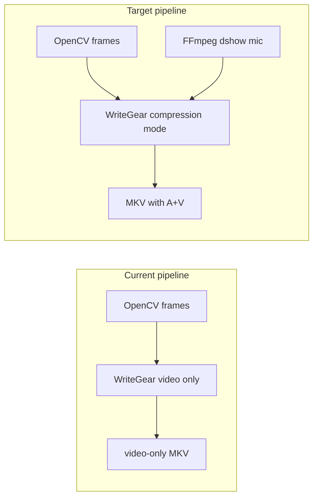

# Enable audio recording when configured

## Finding: audio is never recorded

| Layer | Status |
|-------|--------|
| YAML configs ([config_webcam_debut.yaml](C:/Users/pho/repos/EmotivEpoc/ACTIVE_DEV/continuous_video_recorder/config_webcam_debut.yaml), [config_epocX_eyecamUSB.yaml](C:/Users/pho/repos/EmotivEpoc/ACTIVE_DEV/continuous_video_recorder/config_epocX_eyecamUSB.yaml)) | `storage.audio_enabled: true`, `storage.audio_device: "Microphone HD Pro Webcam C920"` |
| [debut_example.py](C:/Users/pho/repos/EmotivEpoc/ACTIVE_DEV/continuous_video_recorder/examples/debut_example.py) docstring | Claims "synchronized audio" |
| [src/recorder.py](C:/Users/pho/repos/EmotivEpoc/ACTIVE_DEV/continuous_video_recorder/src/recorder.py) | **Ignores** `audio_*`; only calls `writer.write(frame)` (video-only) |
| `pyaudio` in [pyproject.toml](C:/Users/pho/repos/EmotivEpoc/ACTIVE_DEV/continuous_video_recorder/pyproject.toml) | Declared but **unused** in `src/` |

All recording paths (`debut_example.py`, [main.py](C:/Users/pho/repos/EmotivEpoc/ACTIVE_DEV/continuous_video_recorder/main.py), [usb_continuous_recorder.py](C:/Users/pho/repos/EmotivEpoc/ACTIVE_DEV/continuous_video_recorder/src/usb_continuous_recorder.py)) share `VideoRecorder`, so the fix belongs there—not in the example loop.

This matches the prior plan note in [.cursor/plans/debut_example_ffmpeg_compression_0ca01f0e.plan.md](C:/Users/pho/repos/EmotivEpoc/ACTIVE_DEV/continuous_video_recorder/.cursor/plans/debut_example_ffmpeg_compression_0ca01f0e.plan.md): compression mode was added, audio was explicitly deferred.



## Recommended approach: WriteGear live audio input (FFmpeg)

Your configs already use `video.compression_mode: true`. VidGear documents live audio muxing in compression mode by passing FFmpeg input params to `WriteGear` ([WriteGear compression usage — live audio](https://abhitronix.github.io/vidgear/v0.3.5-stable/gears/writegear/compression/usage/#using-compression-mode-with-live-audio-input)).

On Windows (your environment), use DirectShow:

```python
# Order matters in the params dict
{
    "-input_framerate": fps,           # required for A/V sync with live frames
    "-f": "dshow",
    "-i": "audio=Microphone HD Pro Webcam C920",
    "-thread_queue_size": "512",
    "-ac": "2",
    "-acodec": "aac",
    "-ar": "44100",
    # existing video params: -vcodec, -crf, -preset, -output_dimensions, -f matroska
}
```

No changes needed in [debut_example.py](C:/Users/pho/repos/EmotivEpoc/ACTIVE_DEV/continuous_video_recorder/examples/debut_example.py) main loop once `VideoRecorder` handles audio. Split/stop already close and recreate the writer via `_create_writer()` / `split_recording()`, which will restart the mic input per file.

**Do not use PyAudio** for capture unless WriteGear/FFmpeg path fails—FFmpeg dshow is the documented VidGear path and avoids a second capture/mux pipeline.

## Implementation steps

### 1. Extend [src/recorder.py](C:/Users/pho/repos/EmotivEpoc/ACTIVE_DEV/continuous_video_recorder/src/recorder.py)

- Read from `storage_config`:
  - `audio_enabled` (default `False`)
  - `audio_device` (required when enabled)
  - optional `audio_sample_rate` (default `44100`), `audio_channels` (default `2`)
- Add `_format_audio_input(device: str) -> str`: if config value lacks `audio=` prefix, prepend it (config currently has bare device name).
- Add `_build_audio_ffmpeg_params() -> dict` with platform-specific input:
  - **Windows** (`sys.platform == "win32"`): `-f dshow`, `-i audio=<device>`
  - **Linux**: `-f alsa`, `-i hw:N` (use device string as-is)
  - **macOS**: `-f avfoundation`, `-audio_device_index` (if device is numeric index)
- Refactor `_build_ffmpeg_output_params()` to assemble params in **insertion order**:
  1. `-input_framerate` (already present — keep for sync)
  2. audio block (only if `audio_enabled`)
  3. existing video block (`-vcodec`, `-crf`, `-preset`, `-output_dimensions`, container `-f`)
- Guard rails:
  - If `audio_enabled` and **not** `compression_mode`: log a clear warning and record **video-only** (OpenCV fourcc path cannot mux live mic cleanly).
  - If `audio_enabled` and `audio_device` missing: log error and treat as disabled (or fail `start_recording` — prefer fail-fast so user knows).
  - On `start_recording` / `split_recording`, log whether audio is active and which device string is used.
- Startup log example: `Recording with audio from dshow: audio=Microphone HD Pro Webcam C920`

### 2. Update [src/config_loader.py](C:/Users/pho/repos/EmotivEpoc/ACTIVE_DEV/continuous_video_recorder/src/config_loader.py)

- Add defaults under `storage`:
  ```yaml
  audio_enabled: false
  audio_device: null
  audio_sample_rate: 44100
  audio_channels: 2
  ```
- Light validation: if `audio_enabled` is true, require non-empty `audio_device`.

### 3. Minimal [debut_example.py](C:/Users/pho/repos/EmotivEpoc/ACTIVE_DEV/continuous_video_recorder/examples/debut_example.py) touch

- After `VideoRecorder(config)` is created (or after `start_recording`), print one line confirming audio on/off from config—helps operators verify without reading logs.
- No loop or signal-handler changes required.

### 4. Tests

Add `tests/test_recorder_audio.py` (or extend recorder tests):

- Unit-test `_build_ffmpeg_output_params()` / audio helper with mocked config:
  - `audio_enabled=false` → no `-f dshow` / no audio `-i`
  - `audio_enabled=true`, Windows → contains `-f: dshow`, `-i: audio=Microphone HD Pro Webcam C920`
  - `audio_enabled=true`, `compression_mode=false` → video params only + warning path (assert audio keys absent)
- No integration test against real hardware in CI.

### 5. Operator note (README or config comment)

Document device discovery on Windows:

```powershell
ffmpeg -list_devices true -f dshow -i dummy
```

The `storage.audio_device` value must match the **exact** DirectShow audio device name from that list (config may need tweaking if Windows reports a slightly different string).

## Verification (manual)

After implementation, on a short test recording:

```powershell
ffprobe -hide_banner "I:\ScreenRecordings\REC_continuous_video_recorder\CAM_....mkv"
```

Expect both `Video` and `Audio` streams. Then re-run whisper batch transcriber on one file—it should pass `load_audio` instead of "Output file does not contain any stream".

## Out of scope

- Re-transcoding existing video-only files
- System-audio / stereo-mix capture (only configured mic device)
- Replacing `pyaudio` dependency (leave as-is unless you want cleanup later)
