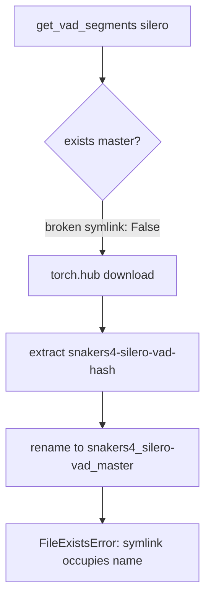

# Fix Silero VAD torch.hub cache on Windows

## What actually failed

CrisperWhisper load succeeded (`Model load: 7.4s`). The abort is later, in Silero preload:

```510:510:scripts/process_recordings.py
get_vad_segments(torch.zeros(16000, dtype=torch.float32), method="silero")
```

Current hub cache under `~/.cache/torch/hub`:

- `snakers4_silero-vad_master` — **broken symlink** → missing `snakers4_silero-vad_v3.1` (leftover from the v3 folder hack in [`transcribe.py`](whisper_timestamped/transcribe.py) ~2063–2096)
- `snakers4_silero-vad_master.tmp` — real checkout with `hubconf.py` (moved aside, never restored)
- `snakers4-silero-vad-1e261b0` — fresh download that cannot be renamed onto `master` because the symlink path already exists → `FileExistsError: [WinError 183]`



Root cause of the false-negative `exists`: `os.path.exists` is False for a broken symlink, so the code thinks the cache is missing and redownloads, then fails on the still-present symlink entry. Folder-hack `finally` uses `os.path.exists` + `os.remove`, so it often fails to clean up on Windows.

## Fix (in [`whisper_timestamped/transcribe.py`](whisper_timestamped/transcribe.py) around `get_vad_segments`)

### 1. Add `_sanitize_silero_hub_cache(repo_or_dir_master)`

Before the local-vs-github decision:

- If `master.tmp` is a real directory and `master` is missing, a symlink, or broken: unlink the symlink entry (`os.path.lexists` + `os.unlink`) and `shutil.move(tmp, master)`.
- Else if `master` is a broken symlink (lexists, islink, not exists): `os.unlink(master)` so torch.hub can install.
- Treat a path as a usable local hub dir only if it is a directory containing `hubconf.py` (not a broken symlink).

### 2. Harden folder-hack cleanup

In `apply_folder_hack` / `finally` (~2091–2096):

- Use `os.path.lexists` / `os.unlink` for the master symlink instead of `os.path.exists` + `os.remove`.
- Only restore `.tmp` if it still exists as a directory.

### 3. Wire sanitize into the load path

Call sanitize once before:

```python
if not os.path.exists(repo_or_dir):
    ...
    source = "github"
```

so a restored `.tmp` becomes `source="local"` and skips the failing download/rename.

No changes to the offline HF helper; this is independent of that work.

## Verification

```powershell
python -c "import torch; from whisper_timestamped.transcribe import get_vad_segments; print(get_vad_segments(torch.zeros(16000), method='silero'))"
```

Expect segments (or empty list) with no `FileExistsError`. Then `python .\scripts\process_recordings.py` should get past “Loading Silero VAD…”.