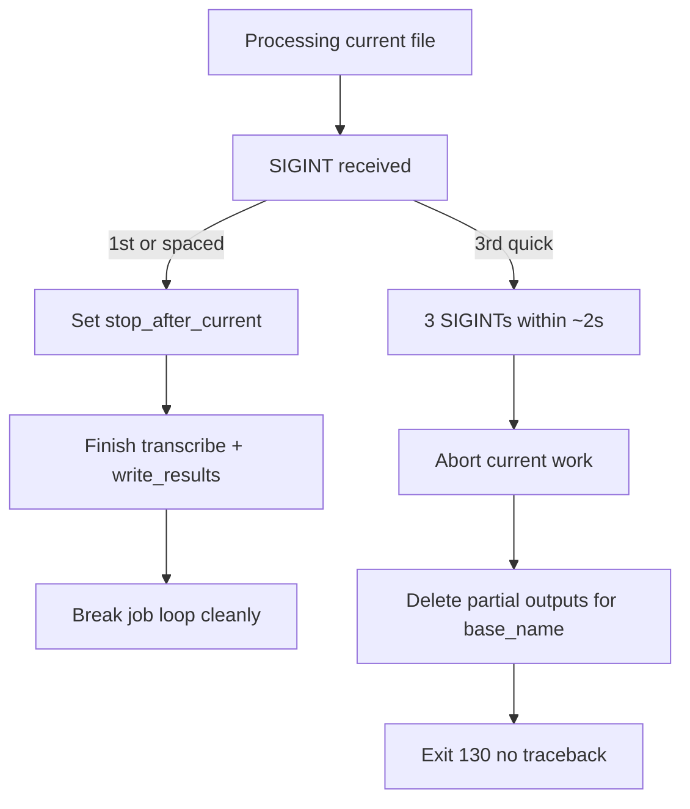

# Graceful Ctrl+C for process_recordings

## Problem

[`scripts/process_recordings.py`](c:\Users\pho\repos\EmotivEpoc\ACTIVE_DEV\whisper-timestamped\scripts\process_recordings.py) has no SIGINT handling. Default Ctrl+C raises `KeyboardInterrupt` deep inside `model.generate` (see your traceback), dumps a stack, and can leave a half-written transcript on disk if interrupt hits during [`write_results`](c:\Users\pho\repos\EmotivEpoc\ACTIVE_DEV\whisper-timestamped\scripts\process_recordings.py) (non-atomic `open`/`json.dump`). That partial file would make [`find_extant_output_files`](c:\Users\pho\repos\EmotivEpoc\ACTIVE_DEV\whisper-timestamped\scripts\process_recordings.py) skip the recording on the next run.

`except Exception` does **not** catch `KeyboardInterrupt`, so the process dies with a traceback today.

Transcription itself does not write temp transcript files; only `write_results` (and then the filelist CSV) touch disk for outputs.

## Desired behavior



| Input | Behavior |
|-------|----------|
| 1× Ctrl+C | Soft stop: print notice; **do not** interrupt torch/transformers; finish current file (transcribe + write + filelist row); then stop the batch |
| 2× within window | Soft still active; print “one more Ctrl+C to force-abort” |
| 3× within ~2s | Force abort: interrupt current work; discard any outputs for the in-flight `base_name`; exit cleanly |

WSL2: install a Python `signal.signal(SIGINT, ...)` handler on the main thread (works under WSL when the process is foreground). Note: during long CUDA/C extensions, delivery can be delayed until control returns to Python—expected limitation.

## Implementation (all in `process_recordings.py`)

### 1. Small interrupt controller

Add a tiny module-level helper (or nested class inside `process_recordings`) holding:

- `stop_after_current: bool`
- `force_abort: bool`
- press timestamps (monotonic), window **2.0s**
- `current_base_name` / `output_dir` while a job is in flight (for cleanup)

SIGINT handler:

1. Append timestamp; drop presses older than the window.
2. If `len >= 3`: set `force_abort`, restore default SIGINT (or raise), and **raise `KeyboardInterrupt`** so blocked `generate` unwinds.
3. Else: set `stop_after_current = True`; print a clear one-line status (`Finishing current recording, then stopping…` / `Press Ctrl+C once more to force-abort`).

Critical: on the first press the handler must **not** raise, or soft-stop is impossible (today’s behavior).

### 2. Wire into the job loop

In `process_recordings`:

- Install handler after model/VAD load (or at start of the job loop); restore previous handler in `finally`.
- At the **top** of each `for audio_path, base_name, row_index in jobs` iteration: if `stop_after_current`, print and `break`.
- Set `current_base_name` / `output_dir` before per-file work; clear after success.
- After a successful write/persist for the current file: if `stop_after_current`, `break` (covers soft stop received mid-file).
- Catch `KeyboardInterrupt` **separately** from `Exception` (do not treat as a failed-file continue):
  - Call discard helper for `current_base_name`.
  - Do **not** mark the file as successfully transcribed in the filelist (filelist is only updated after full `write_results` today—keep that).
  - Re-raise or return after printing a short message so `__main__` can `sys.exit(130)`.

### 3. Discard partial outputs (force-abort / mid-write interrupt)

Add `_discard_transcript_outputs(output_dir, base_name) -> List[Path]`:

- For every suffix in `_TRANSCRIPT_OUTPUT_SPECS` (and the skip suffixes used by `find_extant_output_files`), unlink if present.
- Print which files were removed.
- Ensures the next run does not skip the recording.

No need to change crisper/transformers internals for this.

### 4. Clean `__main__` exit

Wrap the `process_recordings(...)` call:

```python
try:
    output_files = process_recordings(...)
except KeyboardInterrupt:
    print("\nInterrupted.", file=sys.stderr)
    sys.exit(130)
```

Avoid dumping the long transformers/torch stack for user-initiated abort.

### 5. Out of scope

- Fixing `[transformers] max_new_tokens` noise (already covered by the quiet-log plan).
- Atomic rewrite of every `write_results` format (discard-on-abort is enough for reprocessability).
- Propagating cancel tokens into HuggingFace `generate` (SIGINT + `KeyboardInterrupt` is sufficient).

## Verification

- Soft: start a multi-file run, Ctrl+C once during progress bar → current file completes and writes; loop stops; no traceback; next run skips that completed file only.
- Force: Ctrl+C three times quickly mid-transcribe → process exits soon after Python handles SIGINT; no partial transcripts for that `base_name`; next run processes it again.
- Accidental: two spaced Ctrl+Cs still soft-stop only (window reset).
