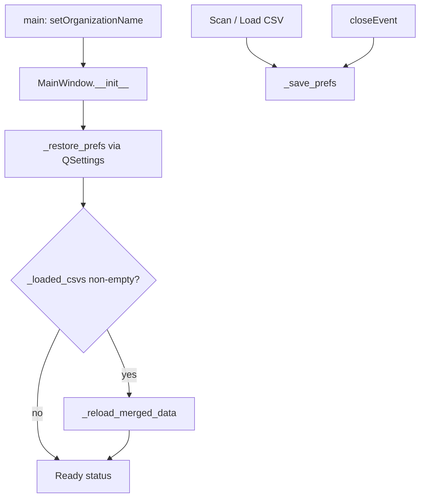

# Persist GUI directory and filelist selection

## Problem
The PyQt6 GUI keeps loaded filelists only in memory (`MainWindow._loaded_csvs`) and opens dialogs with empty/`Path.home()` defaults. Nothing is saved on exit, so relaunch always starts blank.

## Approach
Use **`QSettings`** (PyQt6 standard; no new deps). Set organization/app in `main()` so keys land under a stable Windows registry/ini location:

```python
app.setOrganizationName("whisper-timestamped")
app.setApplicationName("AudioRecordingManager")
```

Store only path-related session state (scope matches the request; not window geometry/filters):

| Key | Value |
|-----|--------|
| `scan/audio_dir` | Last accepted scan audio directory |
| `scan/format_id` | Last scan format combo data (empty string = Auto-detect) |
| `scan/timezone` | Last timezone string |
| `scan/csv_path` | Last scan output CSV path |
| `loaded_csvs` | `format_id → absolute CSV path` map (string list or child keys) |
| `browse/load_csv_dir` | Parent dir of last Load CSV selection |
| `transcribe/output_dir` | Last accepted transcription output dir |

## Files to change

### 1. New helper — [`scripts/gui/preferences.py`](c:\Users\pho\repos\EmotivEpoc\ACTIVE_DEV\whisper-timestamped\scripts\gui\preferences.py)
Thin wrapper around `QSettings`:
- `load_prefs() -> dict` / `save_prefs(prefs)`
- Helpers to read/write the `loaded_csvs` map and path strings
- On load: drop CSV paths that no longer exist (skip silently; do not crash startup)

### 2. [`scripts/gui/main_window.py`](c:\Users\pho\repos\EmotivEpoc\ACTIVE_DEV\whisper-timestamped\scripts\gui\main_window.py)
- **`main()`**: set org/app name before constructing the window
- **`MainWindow.__init__`**: after `_connect_signals()`, call `_restore_prefs()`:
  - populate `_loaded_csvs` from settings
  - if any CSVs remain, call `_reload_merged_data()` and update status bar
- **`_on_scan_clicked`**: pass last scan fields into `ScanConfigDialog`; after accept (before starting worker), save scan paths/settings
- **`_on_scan_finished` / `_on_load_csv_clicked`**: after updating `_loaded_csvs`, save prefs (so a crash mid-session still keeps the last good load)
- **`_on_load_csv_clicked`**: start `QFileDialog` in `browse/load_csv_dir` instead of `""`
- **`_start_transcription`**: after dialog accept, save `transcribe/output_dir`
- **`closeEvent`**: call `_save_prefs()` before worker teardown

### 3. [`scripts/gui/dialogs.py`](c:\Users\pho\repos\EmotivEpoc\ACTIVE_DEV\whisper-timestamped\scripts\gui\dialogs.py)
Extend constructors with optional initial values (no behavior change when omitted):
- `ScanConfigDialog(..., initial_audio_dir="", initial_format_id="", initial_timezone=None, initial_csv_path="")` — prefill line edits / combo
- `TranscribeConfigDialog` already takes `default_output_dir`; prefer restored `transcribe/output_dir` when calling from `MainWindow` if the derived default is empty, otherwise keep the current CSV-derived default (existing logic wins when present)

## Restore flow



## Out of scope
Window size/docks, table selection, filter/search widgets, volume, and model/backend combo — not requested; can be added later on the same `QSettings` object.
