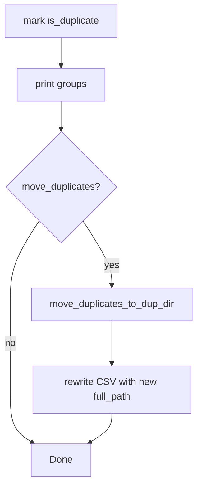

# Move detected duplicates to `_DUP/`

## Scope

Only [`extract_m4a_creation_times.py`](c:\Users\pho\repos\EmotivEpoc\ACTIVE_DEV\whisper-timestamped\scripts\iOSWhisperAppHelpers\extract_m4a_creation_times.py).

Default remains annotation-only. Moves happen only when `--move-duplicates` is passed.

## Behavior

1. After `mark_creation_time_duplicates` + `print_creation_time_duplicates`, if `move_duplicates` is True, call a new helper.
2. Destination: `{audio_dir}/_DUP/` (`mkdir(parents=True, exist_ok=True)`).
3. For each row with `is_duplicate == True`:
   - Resolve source via existing `resolve_audio_path(row, audio_dir)`.
   - Skip (warn) if missing, or if the file is already under `_DUP`.
   - Dest = `_DUP / source.name`. If that path exists, append `_{n}` before the suffix until free (`foo.m4a` → `foo_2.m4a`).
   - `source.rename(dest)` (same-volume move).
   - Update that row’s `full_path` to `str(dest)` (and `name` to `dest.name` if the name changed due to collision).
4. After moves, rewrite the output CSV so paths stay accurate.
5. Print a short summary: `moved=N skipped=M fail=K -> _DUP`.

## Wiring

- Add `move_duplicates: bool = False` through `extract_for_csv` / `main`.
- CLI: `parser.add_argument("--move-duplicates", action="store_true", ...)`.
- Mention the flag in the module docstring and argparse description.
- Return `moved` count from the helper; include `moved=...` in the final `Done.` line when the flag was used (always print `moved=0` when flag off is fine and simpler).



## Concrete helper signature

```python
def move_duplicates_to_dup_dir(
    df: pd.DataFrame,
    audio_dir: Path,
) -> Tuple[int, int, int]:
    """Move is_duplicate rows into audio_dir/_DUP/. Return (moved, skipped, fail)."""
```

No dry-run mode (flag itself is the explicit opt-in). Keepers stay in place.