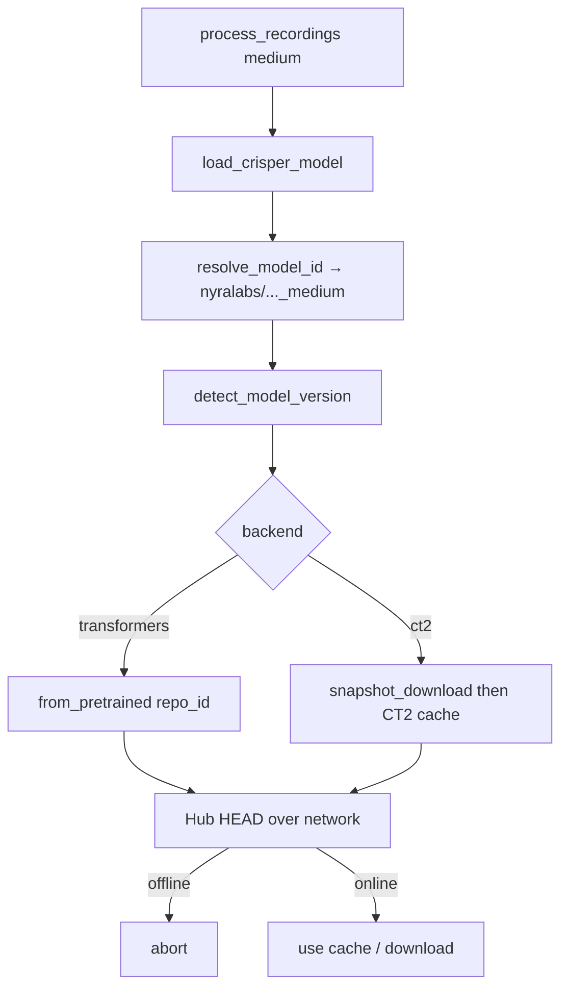

# Offline CrisperWhisper model loading

## Root cause

`scripts/process_recordings.py` loads `"medium"` → resolves to HF id `nyralabs/CrisperWhisper2.0_medium` → `TransformersEngine` calls `AutoProcessor.from_pretrained(repo_id)` **without** `local_files_only`. HuggingFace Hub always does a network HEAD (etag check) for repo ids, even when the snapshot is already under `~/.cache/huggingface/hub`. Offline DNS failure then aborts.

Same pattern exists on the CT2 path (`snapshot_download` / `hf_hub_download`) and runs **before** the converted CT2 cache under `~/.cache/crisperwhisper` is checked.



## Approach

Add a small Hub helper that **tries normal Hub access first, then retries with `local_files_only=True` on connectivity failures**, and honors `HF_HUB_OFFLINE` / `TRANSFORMERS_OFFLINE` when already set. Wire it into every Crisper Hub call site. No new CLI flag required (matches “continue with previously downloaded models”).

## Changes

### 1. Shared helper — new [`whisper_timestamped/crisperwhisper/hub_offline.py`](whisper_timestamped/crisperwhisper/hub_offline.py)

- `hub_force_offline()` — true when `HF_HUB_OFFLINE` or `TRANSFORMERS_OFFLINE` is truthy.
- `is_hub_connectivity_error(exc)` — match DNS / connection / closed-client failures (incl. the `RuntimeError: Cannot send a request, as the client has been closed.` seen in the traceback).
- `call_with_local_files_fallback(fn, *, local_files_only_kw="local_files_only")` — if forced offline, call with `local_files_only=True`; else call normally, and on connectivity error log a short warning and retry with `local_files_only=True`.

### 2. Transformers load (your failing path) — [`transformers_engine.py`](whisper_timestamped/crisperwhisper/transformers_engine.py)

Wrap both `AutoProcessor.from_pretrained` (~L140) and `AutoModelForSpeechSeq2Seq.from_pretrained` (~L148) through the helper so offline uses the existing HF cache snapshot.

### 3. Version probe — [`version.py`](whisper_timestamped/crisperwhisper/version.py)

- Fast path: if `model_name_or_path` is an official / `nyralabs/CrisperWhisper2.0_*` id, return `2` without Hub I/O.
- For other HF ids, wrap `hf_hub_download` with the same local-files fallback (existing `except` already falls through to “assume v2”).

### 4. CT2 path — [`converter.py`](whisper_timestamped/crisperwhisper/converter.py)

- In `ensure_ct2_model`: if the conversion cache hit (`ct2_dir` + `.conversion_complete`) exists for this model id + quantization, **return it before** `_resolve_hf_or_local` / `snapshot_download`.
- In `_resolve_hf_or_local`: wrap `snapshot_download` with the local-files fallback so a warm HF cache still works when no CT2 conversion exists yet.

### 5. Plumbing (minimal)

No need to thread `download_root` into Crisper for this fix — Crisper already uses the default HF hub cache. Leave `process_recordings` comment as-is; behavior change is inside the vendored loader.

## Verification (after implementation)

On WSL2 with no internet (or `HF_HUB_OFFLINE=1`):

```bash
python -c "from whisper_timestamped.crisper_backend import load_crisper_model; m=load_crisper_model('medium', crisper_runtime='transformers'); print(m)"
```

Expect load from cache with at most a one-line fallback warning, not a traceback. Same check with `crisper_runtime='ct2'` if the CT2 fork + conversion cache are present.