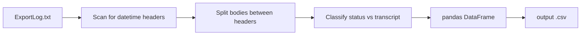

# Parse iOS WhisperApp Bulk Transcript Export

## Format (from the sample log)

Entries are delimited by a **datetime-only header line**, then a body until the next header:

| Kind | Header example | Body |
|------|----------------|------|
| Recovered (no text) | `2026-07-29 22:03:52` | `Recovered recording (transcription lost)` |
| Interrupted | `7/30/26, 1:12 PM` | `Transcription interrupted. Tap retry to continue.` |
| Saved (no text) | `9/23/26, 9:18 PM` | `Saved recording` |
| Transcribed | `7/30/26, 12:45 PM` | Multi-paragraph transcript (blank lines allowed) |

Observed counts in [`2026-09-24_ExportLog.txt`](H:/backups/2026-09-21_iPhone15Pro/WhisperApp/Bulk/2026-09-24_ExportLog.txt): **100** headers (15 ISO, 85 US); bodies ~61 transcripts, 20 saved, 15 recovered, 4 interrupted.

Important parsing details:
- US times use a **narrow no-break space** (`\u202f`) before `AM`/`PM` — normalize to a regular space before parsing.
- Two-digit year (`26` → 2026).
- Same timestamp can appear more than once (e.g. two `Saved recording` stubs then a transcript). **Keep every entry as its own row**; do not merge/dedupe.

The highlighted block at lines 43–76 is two entries: the `2026-07-29 22:03:52` recovered stub, then the separate `7/30/26, 12:45 PM` transcript.

## Deliverable

New file: [`scripts/iOSWhisperAppHelpers/parse_iOSWhisperApp_bulk_transcript_export.py`](C:/Users/pho/repos/EmotivEpoc/ACTIVE_DEV/whisper-timestamped/scripts/iOSWhisperAppHelpers/parse_iOSWhisperApp_bulk_transcript_export.py)

Style aligned with sibling [`scripts/iOSWhisperAppHelpers/dedupe_m4a_exports.py`](C:/Users/pho/repos/EmotivEpoc/ACTIVE_DEV/whisper-timestamped/scripts/iOSWhisperAppHelpers/dedupe_m4a_exports.py): `argparse`, `pathlib`, type hints, `## END for ...` loop closers.

## Behavior

1. **CLI**
   - Positional: `input_path` (the export `.txt`)
   - `-o/--output`: CSV path; default = same directory/stem as input with `.csv` (e.g. `.../2026-09-24_ExportLog.csv`)
2. **Parse**
   - Regex for ISO: `YYYY-MM-DD HH:MM:SS`
   - Regex for US: `M/D/YY, h:mm AM/PM` after normalizing `\u202f`/`\xa0`
   - Body = lines after header until next header; `strip()` for storage
   - Status classification:
     - exact match → `recovered_transcription_lost` / `transcription_interrupted` / `saved_recording`
     - non-empty other text → `transcribed` (full body in `transcription`)
     - empty body → `empty`
3. **DataFrame columns**
   - `entry_index` (0-based order in file)
   - `datetime` (`pandas` datetime64, timezone-naive)
   - `datetime_raw` (original header string, spaces normalized)
   - `status` (one of the labels above)
   - `transcription` (full text, or empty string when unavailable)
   - `has_transcription` (bool)
4. **Output**
   - `df.to_csv(..., index=False, encoding='utf-8')`
   - Print a one-line summary: entry counts by `status`, output path

## Smoke check (after implement)

Run against the sample log and confirm ~100 rows and that the `7/30/26, 12:45 PM` row has the long “confounded…” transcript while the preceding recovered row has empty transcription.