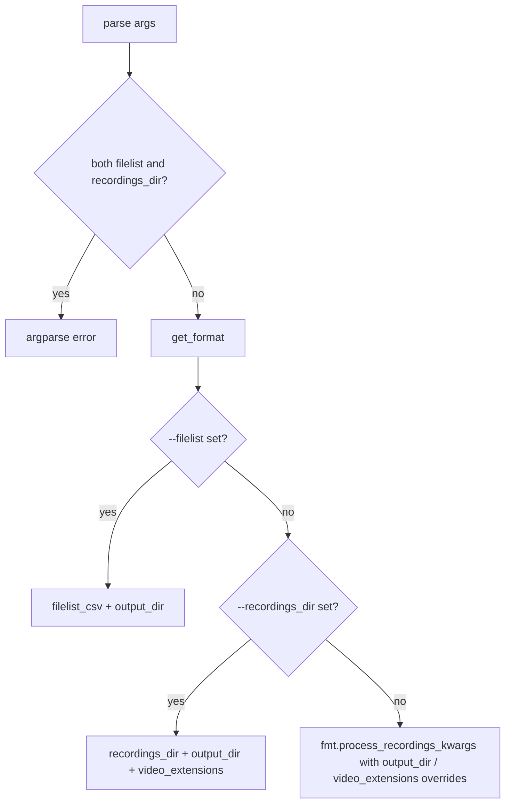

# Add CLI flags to process_recordings

## Approach

Wire `argparse` in [`scripts/process_recordings.py`](c:/Users/pho/repos/EmotivEpoc/ACTIVE_DEV/whisper-timestamped/scripts/process_recordings.py) `__main__` only. Keep the existing default format constant; do not change `process_recordings()` itself or the format registry. Flag names use underscores to match the Python kwargs (`--recordings_dir`, etc.).

## Flags

| Flag | Maps to | Default |
|------|---------|---------|
| `--format` / `-f` | format id for `get_format` | `DEFAULT_FORMAT` (`"ios_whisper_app"`) |
| `--filelist` | `filelist_csv` | format’s `resolve_filelist_csv()` when format is filelist mode |
| `--recordings_dir` | `recordings_dir` | format default when format is directory mode |
| `--output_dir` | `output_dir` | format’s `default_output_dir` |
| `--video_extensions` | `video_extensions` | format’s `media_extensions` (directory mode only) |

`--format` validates against `list_format_ids()`. `--video_extensions` is a comma-separated string (e.g. `.m4a,.caf`), normalized to a list of lowercase extensions with a leading dot.

## Kwargs resolution

`process_recordings()` requires exactly one of `filelist_csv` or `recordings_dir`. Resolve as follows:



- Both `--filelist` and `--recordings_dir` → `parser.error(...)`.
- `--filelist` only → force filelist kwargs (works even if format `input_mode` is `"directory"`). Apply `--output_dir` when set, else `fmt.default_output_dir`. Ignore `--video_extensions`.
- `--recordings_dir` only → force directory kwargs (works even if format `input_mode` is `"filelist"`). Apply `--output_dir` / `--video_extensions` when set, else format defaults.
- Neither → `fmt.process_recordings_kwargs(output_dir=..., video_extensions=...)` so filelist formats still use newest-by-mtime CSV; directory formats use defaults with optional overrides.

Keep backend kwargs hardcoded (`crisperwhisper` / `medium` / `verbatim` / `auto`), plus the kwargs print and KeyboardInterrupt handling.

Example:

```bash
uv run python scripts/process_recordings.py \
  --format ios_whisper_app \
  --filelist "H:/backups/2026-09-21_iPhone15Pro/WhisperApp/filelists/2026-10-07_audio_file_list.csv" \
  --output_dir "H:/backups/2026-09-21_iPhone15Pro/WhisperApp/transcriptions"
```

Directory-mode example:

```bash
uv run python scripts/process_recordings.py \
  --format ios_whisper_app \
  --recordings_dir "H:/backups/2026-09-21_iPhone15Pro/WhisperApp/Audio/2026-10-07" \
  --video_extensions ".m4a,.caf"
```

(`host_path` inside `process_recordings` already maps `H:/...` ↔ `/mnt/h/...`.)

## File changes

### 1. [`scripts/process_recordings.py`](c:/Users/pho/repos/EmotivEpoc/ACTIVE_DEV/whisper-timestamped/scripts/process_recordings.py)

- Real `import argparse`; import `list_format_ids`.
- `DEFAULT_FORMAT = "ios_whisper_app"` (replaces `ACTIVE_FORMAT` role).
- Implement the flags and resolution logic above in `__main__`.

### 2. [`README_RUNNING_CLI.md`](c:/Users/pho/repos/EmotivEpoc/ACTIVE_DEV/whisper-timestamped/README_RUNNING_CLI.md)

Document build-filelist + `process_recordings.py --format ... --filelist ...` (and briefly note `--recordings_dir` / `--output_dir` / `--video_extensions`).

## Out of scope

- No backend / model CLI flags.
- No changes to `extract_m4a_creation_times.py` or format classes.
- No new tests (script entrypoint only).
