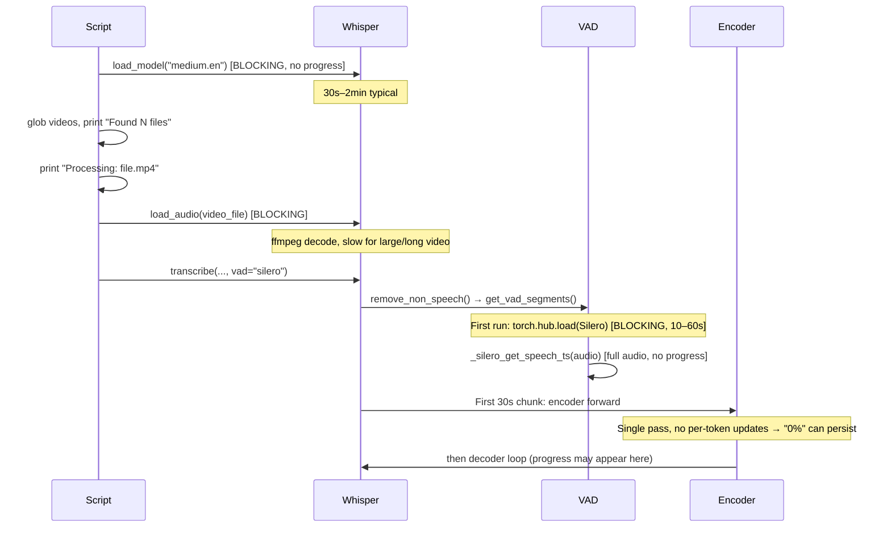

# process_recordings.py performance diagnosis

## Root cause: multiple blocking phases with no progress feedback

The script has **no progress bar or percentage** of its own. “Staying at 0%” is either (1) a progress bar from a dependency (e.g. PyTorch/torch.hub or a downstream transcribe step) that only updates after the encoder/decoder starts, or (2) the script simply printing nothing for a long time. In both cases, the following phases run **without any script-level progress** and explain the perceived slowness.

### Execution order and bottlenecks

### 1. Whisper model load (main suspect for “long while at 0%”)

**Location:** [scripts/process_recordings.py](C:\Users\pho\repos\EmotivEpoc\ACTIVE_DEV\whisper-timestamped\scripts\process_recordings.py) lines 194–200.

- **What happens:** `whisper.load_model("medium.en", download_root=model_path_root)` runs **once** before any file is processed.
- **Why it’s slow:** Loading a ~1.5GB model from disk (or downloading), moving to GPU/CPU, and initializing PyTorch/CUDA. Often **30 seconds to several minutes**; no progress is printed.
- **Effect:** User sees “Loading Whisper model…” and then nothing until the model is ready and the loop starts.

### 2. First-file Silero VAD load (when using `vad="silero"`)

**Location:** [whisper_timestamped/transcribe.py](C:\Users\pho\repos\EmotivEpoc\ACTIVE_DEV\whisper-timestamped\whisper_timestamped\transcribe.py) ~293–296 → `get_vad_segments()` ~1956–1999.

- **What happens:** On the **first** call to `transcribe(..., vad="silero")`, `remove_non_speech()` calls `get_vad_segments()`, which does `torch.hub.load(repo_or_dir=..., model="silero_vad", ...)` when `_silero_vad_model.get(version) is None`.
- **Why it’s slow:** First-time download and load of Silero VAD; often **10–60 seconds** with no progress message.
- **Effect:** After “Processing: file.mp4” and after `load_audio`, the process can sit with no visible progress while Silero loads, then while VAD runs over the full audio.

### 3. Audio loading

**Location:** [scripts/process_recordings.py](C:\Users\pho\repos\EmotivEpoc\ACTIVE_DEV\whisper-timestamped\scripts\process_recordings.py) line 248.

- **What happens:** `whisper.load_audio(str(video_file))` decodes the video to 16 kHz mono (typically via ffmpeg under the hood in openai-whisper).
- **Why it’s slow:** Full decode of the file; large or long videos can take tens of seconds.
- **Effect:** No progress is printed during this step.

### 4. Encoder phase before any “progress” updates

**Location:** [whisper_timestamped/transcribe.py](C:\Users\pho\repos\EmotivEpoc\ACTIVE_DEV\whisper-timestamped\whisper_timestamped\transcribe.py) `_transcribe_timestamped_efficient` (chunk loop).

- **What happens:** For each 30s chunk, the **encoder** runs first (full chunk in one forward pass); only then does the decoder run token-by-token. The script does not pass `verbose=True`, and with `vad="silero"` the library sets `whisper_options["verbose"]` to `None`, so there is no per-segment progress from whisper_timestamped.
- **Why it feels like 0%:** If any progress bar is tied to “decoder steps” or “segments,” it can stay at 0% for the whole encoder phase of the first (or every) chunk. Long first chunk ⇒ long time at 0%.

### 5. No script-level progress

- The script never reports “file 1 of N” or “loading model… done” or “transcribing chunk 1 of M.”
- So the only visible milestones are: “Loading Whisper model…”, “Found N video files”, “Processing: ”, then later “building output files…”. Everything in between is a black box.

---

## Recommended next steps (diagnosis first, then UX/speed)

1. **Confirm which phase is slow**
  Add coarse timing (e.g. `time.perf_counter()`) around:
  - Model load (before/after `whisper.load_model`).
  - For the first file only: before/after `load_audio`, before/after `whisper.transcribe` (to capture VAD load + VAD run + first chunk encoder/decoder).  
   Log one line per phase (e.g. “Model load: Xs”, “First file load_audio: Xs”, “First file transcribe: Xs”). That will show whether the “long while at 0%” is model load, first-file VAD/load_audio, or first encoder chunk.
2. **Improve perceived performance with progress messages**
  - After `whisper.load_model`, print e.g. “Whisper model loaded.”  
  - Before/after `load_audio` for each file: “Loading audio…” / “Audio loaded.”  
  - Optionally, at the start of the first transcribe, print “Running VAD and transcription…” so that the first Silero load doesn’t look like a hang.
3. **Optional: defer model load**
  Move `whisper.load_model` to **after** discovering the file list and printing “Found N video files” (and optionally after creating the alias_dir). That way the script shows “Found N files” quickly; the long block then becomes “Loading Whisper model…” → “Whisper model loaded.” Same total time, but clearer that the script is busy with model load, not stuck.
4. **Optional: preload Silero VAD**
  If diagnosis shows the first transcribe is slow due to Silero: call a no-op that triggers VAD load (e.g. get_vad_segments on a tiny tensor) once after model load, with a print “Loading Silero VAD…” before and “Done.” after. That moves the delay to a known, labeled phase instead of the first file’s transcribe.
5. **Device and model size**
  The script does not pass `device` to `load_model`; if GPU is available, ensuring the model runs on GPU (e.g. via `whisper.load_model(..., device="cuda")` or the project’s preferred API) will speed up both encoder and decoder and can make the “0%” period shorter.

---

## Summary

| Phase                      | When                                 | Typical duration                           | Progress shown                           |
| -------------------------- | ------------------------------------ | ------------------------------------------ | ---------------------------------------- |
| Whisper model load         | Once, before any file                | 30s–2min                                   | “Loading…” only, then nothing until done |
| Silero VAD load            | First transcribe with `vad="silero"` | 10–60s first run                           | None                                     |
| load_audio                 | Per file                             | Seconds to tens of seconds for large video | None                                     |
| Encoder (first chunk)      | Start of each transcribe             | Depends on chunk length / hardware         | Often 0% if progress is decoder-based    |
| Decoder / rest of pipeline | After encoder                        | Updates as tokens/segments complete        | May be first time user sees progress     |

The “runs very slowly, staying at 0% for a long while” behavior is best explained by **model load** and/or **first-file VAD load + encoder**, with **no script-level progress** in between. Adding timing and the suggested messages will confirm which phase dominates and make the run feel more responsive.