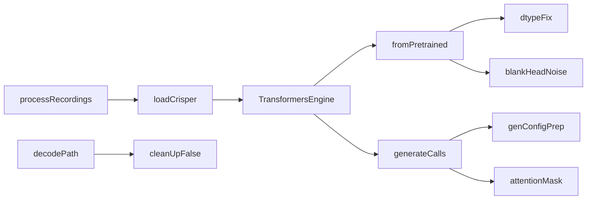

# Quiet CrisperWhisper transformers log noise

## Context

Runtime is **`crisper_runtime='transformers'`** (Linux fallback when `crisper_ct2` is not installed). Nearly every `[transformers]` line comes from [`whisper_timestamped/crisperwhisper/transformers_engine.py`](whisper_timestamped/crisperwhisper/transformers_engine.py). [`scripts/process_recordings.py`](scripts/process_recordings.py) does not set HF verbosity; leave its status prints alone (including the EDF alias skip).

Prefer fixing call sites. Only suppress logging for the one case that is architecturally expected (`encoder_blank_head`).

## Changes (all in transformers / decode path)

### 1. Load: `dtype` + quiet unexpected blank head

In `TransformersEngine.__init__` (~L141–146):

- Pass **`dtype=self.torch_dtype`** instead of deprecated `torch_dtype=` (project pins `transformers>=4.53.2`; env seen as 5.x).
- Keep `attn_implementation="eager"`.
- Around `from_pretrained` only: temporarily set transformers verbosity to error so the expected **UNEXPECTED** `encoder_blank_head.{weight,bias}` LOAD REPORT is not printed. Those weights are Crisper-specific and unused by stock `WhisperForConditionalGeneration`; blank timing already uses mel/space fallbacks in [`word_timing.py`](whisper_timestamped/crisperwhisper/word_timing.py). Restore prior verbosity in `finally`.

### 2. Init: neutralize config fields that fight our generate kwargs

After load (alongside existing `forced_decoder_ids` / `begin_suppress_tokens` clears ~L152–159):

- Snapshot suppress list into `default_suppress_tokens` (already done), then set **`generation_config.suppress_tokens = None`** so HF does not also build `SuppressTokensLogitsProcessor` when we pass `suppress_tokens=`.
- Set **`generation_config.max_length = None`** (or clear it) so passing `max_new_tokens` no longer collides with checkpoint `max_length=448`.
- Set **`tokenizer.clean_up_tokenization_spaces = False`**.

### 3. Generate: one prepared `GenerationConfig` (no mixed kwargs)

Add a small helper (e.g. `_prepare_generation_config`) used by `_run_generate`, `_run_generate_with_attention`, and `greedy_stops_and_decode`:

- `copy.deepcopy(self.model.generation_config)`
- Set `max_new_tokens`, `num_beams`, `do_sample`, temperature/top_k as needed
- Set `suppress_tokens` on the **copied** config (not as a duplicate kwarg if already on config—pick one path: config-only for suppress)
- For attention capture: set `output_attentions=True` and `return_dict_in_generate=True` **on the copied config**, not as generate kwargs (fixes “flags not valid” + “generation_config together with …” for `output_attentions`)
- Call `model.generate(features, generation_config=gc, decoder_input_ids=dec, logits_processor=..., attention_mask=...)` with **non-generation** args only

Teacher-forced `_cross_attention_rows` can keep `output_attentions=True` on **`model(...)` forward** (valid there); no change needed unless it still warns.

### 4. Encoder `attention_mask`

Feature extract currently returns mel only (~L321–326). At each `generate` call, pass:

`attention_mask = torch.ones(features.shape[0], features.shape[-1], device=features.device, dtype=torch.long)`

(Whisper expects a mask over mel frames for unpadded 30s chunks.)

### 5. Decode: `clean_up_tokenization_spaces=False`

- [`TransformersEngine.decode_tokens`](whisper_timestamped/crisperwhisper/transformers_engine.py) (~L300): pass `clean_up_tokenization_spaces=False`.
- Per-token `tokenizer.decode([t])` sites that bypass the helper: [`word_timing.py`](whisper_timestamped/crisperwhisper/word_timing.py) (~L634), [`longform/token_lcs.py`](whisper_timestamped/crisperwhisper/longform/token_lcs.py) (~L237, ~L278).

## Out of scope / leave alone

- Progress bars, “Skipping EDF alias…”, and process_recordings status lines.
- Blanket `warnings.filterwarnings` / global `TRANSFORMERS_VERBOSITY` in the script.
- [`converter.py`](whisper_timestamped/crisperwhisper/converter.py) `dtype`↔`torch_dtype` patch (CT2 conversion only).
- Syncing the sibling [`CrisperWhisper`](c:\Users\pho\repos\EmotivEpoc\ACTIVE_DEV\CrisperWhisper) tree unless you ask later.

## Verification

- Re-run a short `process_recordings` / single-file crisperwhisper transformers transcribe on Linux; confirm the listed `[transformers]` warnings are gone while word timestamps still populate.
- Existing unit tests (`tests/test_crisper_backend.py`) stay green; no new model-download test required.

## Ops note (not a code change)

On Apogee, `uv sync --extra crisper_ct2` would select the CT2 runtime (`auto`), avoiding most HF noise and speeding batch work. The code fixes above still matter for Windows and Linux without the fork.