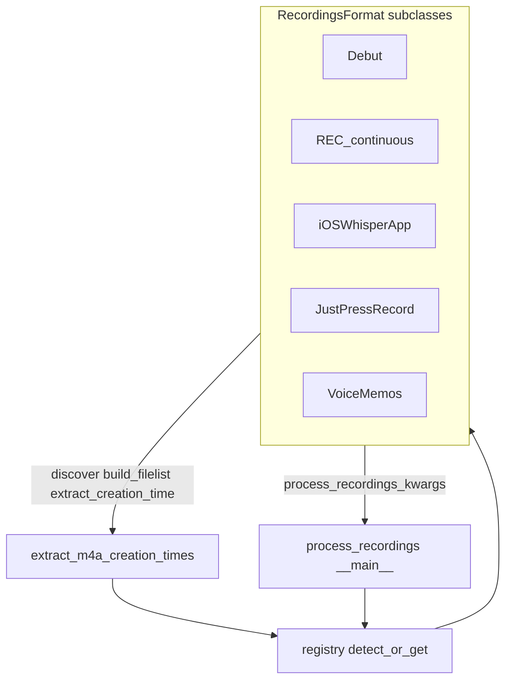

# Recordings format class refactor

## Problem

Format knowledge is scattered as commented `__main__` presets in [`scripts/process_recordings.py`](c:/Users/pho/repos/EmotivEpoc/ACTIVE_DEV/whisper-timestamped/scripts/process_recordings.py) and ad-hoc JPR/WhisperApp branching in [`scripts/iOSWhisperAppHelpers/extract_m4a_creation_times.py`](c:/Users/pho/repos/EmotivEpoc/ACTIVE_DEV/whisper-timestamped/scripts/iOSWhisperAppHelpers/extract_m4a_creation_times.py). Adding Apple VoiceMemos (`YYYYMMDD HHMMSS-*.m4a`) would make that worse.

## Approach

Add an importable package next to existing library helpers (same pattern as [`whisper_timestamped/parse_video_filename.py`](c:/Users/pho/repos/EmotivEpoc/ACTIVE_DEV/whisper-timestamped/whisper_timestamped/parse_video_filename.py)):

`whisper_timestamped/recording_formats/`



### Base class API

`RecordingsFormat` owns:

- `id`, `label` — stable key e.g. `voice_memos`, display name
- `media_extensions` — e.g. `.mp4`/`.mkv` or `.m4a`/`.caf`
- `input_mode` — `directory` (Debut/CAM) or `filelist` (audio formats)
- `default_recordings_dir`, `default_output_dir`, `default_filelists_dir` — current hardcoded `H:/` / `M:/` / `I:/` paths moved out of `__main__`
- `matches_folder(path)` — sample media under path; majority must match
- `matches_file(path)` — filename/path pattern for one file
- `transcript_name(path)` — CSV `name` / output stem (JPR concatenates date+time; VoiceMemos keeps filename; video uses stem)
- `extract_creation_time(path, tz=...)` — format-specific wall-clock string, or `None` so caller falls back to ffprobe
- `discover_media(recordings_dir)` — flat vs one-level nest vs VoiceMemos flat `.m4a`
- `ensure_filelist_csv(...)` — bootstrap CSV with today’s column schema
- `process_recordings_kwargs(...)` — the dict `__main__` currently hand-builds

Shared filelist columns stay: `name`, `size_bytes`, `size_mb`, `creation_time`, `modification_time`, `full_path`, plus extract columns `extracted_creation_time`, `duration (seconds)`, `duration_hms`, `is_duplicate`. VoiceMemos adds optional `title` when the Apple DB is available.

### Concrete formats

1. **Debut** — prefix `Debut_`, pattern `YYYY-MM-DDTHHMMSS`, extensions `.mp4`/`.mkv`, `input_mode=directory`, default `M:\ScreenRecordings\EyeTrackerVR_Recordings`.
2. **REC_continuous_video_recorder** — prefix `CAM_`, same datetime pattern, default `I:/ScreenRecordings/REC_continuous_video_recorder`.
3. **iOSWhisperApp** — flat `.m4a`/`.caf`; creation time from ffprobe (current behavior); defaults under `H:/.../WhisperApp/`.
4. **JustPressRecord** — `YYYY-MM-DD/HH-MM-SS.ext`; move `parse_just_press_record_path` onto this class; filelist + nested discover; current JPR defaults.
5. **VoiceMemos** (new, ready to run) — flat `audio/*.m4a` matching `^(\d{8}) (\d{6})(?:-[0-9A-Fa-f]+)?\.m4a$`; creation time from filename as `YYYY-MM-DD HH:MM:SS` (no TZ convert, same as JPR); `matches_folder` true when folder (or `audio/` child) is mostly that pattern. Defaults: recordings `H:/.../VoiceMemos/audio`, filelists `.../VoiceMemos/filelists`, transcriptions `.../VoiceMemos/transcriptions`. If sibling `group.com.apple.VoiceMemos.shared/Recordings/CloudRecordings.db` exists, join `ZPATH` to `ZCUSTOMLABELFORSORTING` into CSV `title`; skip DB quietly if missing/unreadable.

Include **Just Press Record** in the registry even though it was not in the original three-name list — it is already the active `__main__` preset and has dedicated path parsing.

Registry: `FORMATS` dict + `get_format(id)` + `detect_format(path)` (try VoiceMemos, then JPR, Debut, CAM, iOSWhisperApp — most specific first).

### Script rewiring

**`process_recordings.py` `__main__`:** replace commented blocks with:

```python
ACTIVE_FORMAT = "just_press_record"  # debut | rec_continuous | ios_whisper_app | just_press_record | voice_memos
fmt = get_format(ACTIVE_FORMAT)
process_recordings_kwargs = fmt.process_recordings_kwargs()
```

Core `process_recordings()` API unchanged (`recordings_dir` vs `filelist_csv`).

**`extract_m4a_creation_times.py`:**

- Remove inline `parse_just_press_record_path` / JPR special-cases from bootstrap and `extract_for_csv`.
- Resolve format via `--format` or `detect_format(--audio-dir)`.
- Call `fmt.transcript_name`, `fmt.extract_creation_time`, `fmt.discover_media` / `ensure_filelist_csv`.
- Keep shared ffprobe, SetFileTime, duplicate marking, CLI flags as-is.
- Defaults for `--audio-dir` / CSV path come from the chosen format (not hard-coded WhisperApp-only).

### Tests

Add [`tests/test_recording_formats.py`](c:/Users/pho/repos/EmotivEpoc/ACTIVE_DEV/whisper-timestamped/tests/test_recording_formats.py) with temp dirs / synthetic filenames:

- `matches_file` / `transcript_name` / `extract_creation_time` for each format (including VoiceMemos with and without `-ID`).
- `detect_format` on miniature folder layouts.
- JPR path parser behavior preserved after move.

### Out of scope

- Changing CrisperWhisper / transcription loop behavior.
- Migrating Debut/CAM onto mandatory filelists (they keep `directory` mode).
- Rewriting `dedupe_m4a_exports.py` or the bulk transcript parser.
- Committing VoiceMemos filelists or modifying files under `H:\backups\...`.
