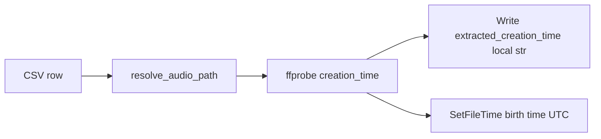

# Set filesystem creation time from m4a metadata

## Goal

After each successful ffprobe of `format.tags.creation_time`, also set that file’s **Windows creation/birth time** to the same instant. CSV columns (`extracted_creation_time`, duration fields) stay as they are today.

## Approach

Edit only [`scripts/iOSWhisperAppHelpers/extract_m4a_creation_times.py`](c:\Users\pho\repos\EmotivEpoc\ACTIVE_DEV\whisper-timestamped\scripts\iOSWhisperAppHelpers\extract_m4a_creation_times.py).

1. **Add `set_windows_creation_time(path, utc_dt)`** using stdlib `ctypes` + `kernel32.SetFileTime` (no pywin32):
   - Convert the aware UTC `datetime` from `probe_format_metadata` to a Windows `FILETIME` via `dt.timestamp()` (Unix epoch → 100-ns intervals since 1601).
   - Open with `CreateFileW` + `FILE_WRITE_ATTRIBUTES` (`0x100`), `OPEN_EXISTING`, share read/write/delete.
   - Call `SetFileTime(handle, creation, NULL, NULL)` so **access and modify times are left unchanged**.
   - Close the handle; raise/`OSError` on invalid handle or failed set (caller logs and counts).

2. **Call it from the existing row loop** in `extract_for_csv` when `utc_dt is not None` (same path already resolved for probing). Do not set when probe missed creation_time.

3. **Counters / summary**: track `fs_set_ok` and `fs_set_fail`; print them in the final `Done.` line alongside existing counts. On failure, print a short per-file warning (same style as existing `!` logs) and continue.

4. **Docs / CLI description**: mention that successful extracts also update Windows file creation time. No new flags — always apply when creation_time is present (paths and usage are already Windows/`H:\...`).

## Notes

- Use the probed **UTC datetime object**, not the local CSV string, so the filesystem instant is correct regardless of `--tz`.
- Non-Windows: if `sys.platform != "win32"`, skip SetFileTime with one startup warning (this script’s defaults are Windows-only).
