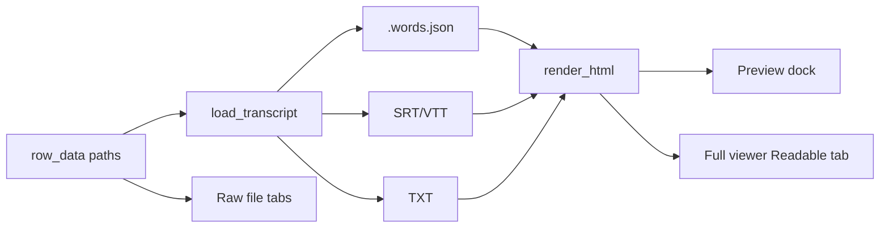

# Readable timestamped transcript display

## Source format

Prefer **`.words.json`** (`transcript_json`) everywhere structured UI is needed. It is the only default output with segment + word timings and confidence (see pipeline writers in [`scripts/process_recordings.py`](c:\Users\pho\repos\EmotivEpoc\ACTIVE_DEV\whisper-timestamped\scripts\process_recordings.py)). Fallbacks stay: segment SRT → VTT → plain TXT.

## Display shape

Shared HTML (dark-theme colors already used in preview):

- Optional header: language, segment count, total span
- Each segment:
  - Time badge with **sub-second precision** (e.g. `00:00.14 – 00:00.94`, hours only when needed)
  - Confidence when present (`96%`)
  - Segment text on the next line
- **Full viewer only:** under each segment, a muted word line with per-word `start–end` (from `segments[].words[]`)
- **Preview:** segment-level only (same styling, denser)

Copy-to-clipboard uses a matching plain-text form (`[00:00.14 – 00:00.94] text`), not HTML tags.

## Implementation

### 1. New helper — [`scripts/gui/transcript_format.py`](c:\Users\pho\repos\EmotivEpoc\ACTIVE_DEV\whisper-timestamped\scripts\gui\transcript_format.py)

- `resolve_path(row, col) -> Optional[Path]` (incl. `/mnt/X/` → `X:/` WSL rewrite already duplicated in main/viewer)
- `format_timestamp(seconds) -> str` with tenths/centiseconds
- `load_transcript(row) -> TranscriptDoc` — prefer JSON segments/words; else parse SRT/VTT; else TXT
- `render_html(doc, *, include_words: bool) -> str`
- `render_plain(doc, *, include_words: bool) -> str`
- `has_any_transcript(row) -> bool` — any non-empty `transcript_*` path

Move the load/parse/render logic currently inlined in [`main_window.py`](c:\Users\pho\repos\EmotivEpoc\ACTIVE_DEV\whisper-timestamped\scripts\gui\main_window.py) `_update_transcript_preview` (~L828–964) and `_format_time` / `_parse_timestamp_to_seconds` (~L66–88) into this module.

### 2. Preview — [`scripts/gui/main_window.py`](c:\Users\pho\repos\EmotivEpoc\ACTIVE_DEV\whisper-timestamped\scripts\gui\main_window.py)

- `_update_transcript_preview` calls `load_transcript` + `render_html(..., include_words=False)`
- Copy button uses `render_plain` (store last `TranscriptDoc` or re-load from `_current_preview_row_data`)
- Context menu “View Transcript”: enable via `has_any_transcript`, not only `transcript_txt` (~L738–743)
- After `_on_file_transcribed`, if the updated row is still selected, refresh the preview

### 3. Full viewer — [`scripts/gui/transcript_viewer.py`](c:\Users\pho\repos\EmotivEpoc\ACTIVE_DEV\whisper-timestamped\scripts\gui\transcript_viewer.py)

- Insert a first **Readable** tab (`QTextEdit`, HTML from `render_html(..., include_words=True)`) when any parseable transcript exists
- Keep existing raw-file tabs after it (txt/srt/vtt/json/csv/…); default selection = Readable
- Copy button: if current widget is the Readable `QTextEdit`, copy `render_plain(..., include_words=True)`; else keep `toPlainText()` for raw tabs

## Out of scope

Changing which files the transcription pipeline writes; click-to-seek from timestamps; editing transcripts.