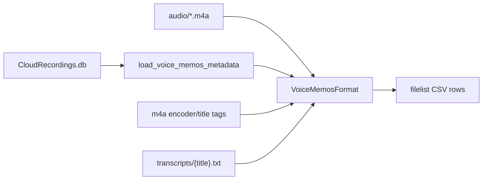

# Finish Apple VoiceMemos metadata from export DB

## What we found

Export layout under [`H:/backups/2026-09-21_iPhone15Pro/VoiceMemos`](H:/backups/2026-09-21_iPhone15Pro/VoiceMemos):

- `audio/` — 292 working `.m4a` files (flattened copy)
- `transcripts/` — 309 Apple built-in `.txt` transcripts named by **Title** (e.g. `Home.txt`, `3081 Promenade Cir 2.txt`)
- `group.com.apple.VoiceMemos.shared/Recordings/CloudRecordings.db` — Core Data SQLite (+ WAL); 305 `ZCLOUDRECORDING` rows

Documented / verified `ZCLOUDRECORDING` fields ([voicememowhisper technical_details](https://github.com/xyb/voicememowhisper/blob/main/docs/technical_details.md), [apple-macos-skill](https://github.com/D1DX/apple-macos-skill)):

| DB field | Meaning |
|---|---|
| `ZENCRYPTEDTITLE` | Display title (matches Explorer Title / m4a `title` / transcript stem). Not encrypted. |
| `ZCUSTOMLABELFORSORTING` | Same as title in this export (0 disagreements) |
| `ZCUSTOMLABEL` | UTC ISO string (e.g. `2019-04-16T00:01:01Z`), **not** a label |
| `ZDATE` | Core Data epoch UTC (`+ 978307200` → Unix) |
| `ZDURATION` / `ZLOCALDURATION` | Duration seconds |
| `ZPATH` | Filename basename (1 row missing path) |
| `ZUNIQUEID` | Recording GUID |
| `ZFOLDER` → `ZFOLDER.ZENCRYPTEDNAME` | Only one folder used (`Offline`); most rows have no folder |

**Not in this DB:** GPS/location, device model. Location-like strings live only in the title. Device appears in m4a tags as `encoder` (e.g. `com.apple.VoiceMemos (iPhone Version 26.0.1 (Build 23A355))`). Preferences plist has no useful recording metadata. `ZRECORDING` table is empty.

Filename wall-clock (`YYYYMMDD HHMMSS`) is already the right local `creation_time` (device local; Eastern for many Michigan-titled memos). Keep that; do **not** replace it with `ZDATE` converted via `America/Los_Angeles`.

## Implementation (concrete)

Primary file: [`whisper_timestamped/recording_formats/voice_memos.py`](c:/Users/pho/repos/EmotivEpoc/ACTIVE_DEV/whisper-timestamped/whisper_timestamped/recording_formats/voice_memos.py).

1. **Replace `load_voice_memos_titles` with `load_voice_memos_metadata(db_path) -> Dict[str, dict]`**
   - Key: `Path(ZPATH).name`
   - Values per row:
     - `title`: `ZENCRYPTEDTITLE` or fallback `ZCUSTOMLABELFORSORTING`
     - `duration_seconds`: `ZDURATION` (float)
     - `recorded_at_utc`: from `ZCUSTOMLABEL` if parseable ISO, else `datetime.utcfromtimestamp(ZDATE + 978307200).strftime("%Y-%m-%d %H:%M:%S")`
     - `unique_id`: `ZUNIQUEID`
     - `folder`: join `ZFOLDER` → `ZENCRYPTEDNAME` (empty string if none)
   - Skip rows with null `ZPATH`; ignore `ZEVICTIONDATE` filter (0 evicted here)
   - Keep quiet empty-dict on missing/unreadable DB
   - Keep `load_voice_memos_titles` as a thin wrapper (`{k: v["title"] for ...}`) so existing exports in [`__init__.py`](c:/Users/pho/repos/EmotivEpoc/ACTIVE_DEV/whisper-timestamped/whisper_timestamped/recording_formats/__init__.py) stay valid

2. **Widen `VoiceMemosFormat.extra_filelist_columns` and `extra_row_fields`**
   - Columns: `title`, `duration_seconds`, `recorded_at_utc`, `unique_id`, `folder`, `apple_transcript`, `encoder`
   - `apple_transcript`: absolute path to `{voice_memos_root}/transcripts/{title}.txt` when that file exists; else `""`
   - `encoder`: from ffprobe `format.tags.encoder` (device proxy); cache per basename; empty if probe fails
   - Keep `extract_creation_time` from filename as today

3. **ffprobe helper (small, local to voice_memos.py)**
   - One subprocess per file on filelist build only (~292 calls; acceptable once)
   - Do not change [`extract_m4a_creation_times.py`](c:/Users/pho/repos/EmotivEpoc/ACTIVE_DEV/whisper-timestamped/scripts/iOSWhisperAppHelpers/extract_m4a_creation_times.py) in this pass (it already fills duration/creation via probe; DB duration is an earlier bootstrap signal)

4. **Tests** in [`tests/test_recording_formats.py`](c:/Users/pho/repos/EmotivEpoc/ACTIVE_DEV/whisper-timestamped/tests/test_recording_formats.py)
   - Synthetic sqlite temp DB with `ZCLOUDRECORDING` (+ optional `ZFOLDER`) covering title/duration/ZDATE/ZPATH/unique_id
   - Assert metadata map + `extra_row_fields` columns
   - Assert missing DB → empty extras without crash
   - Optional: tiny fake `transcripts/Home.txt` → `apple_transcript` populated

## Known limitations (document in code comments only, briefly)

- No GPS/location column exists in schema; place names are titles only
- Two duplicate titles in this export (`Home`×2, `3081 Promenade Cir 236`×2) → transcript path can be ambiguous
- One title uses `/` and narrow no-break space; Apple’s `.txt` export mangled those characters — exact stem match may miss that one file
- 12 DB rows have no copy under `audio/` (stubs / not flattened); filelist only covers discovered media

## Out of scope

- Rewriting Apple transcript files or renaming audio
- Changing `process_recordings` output naming away from m4a basename
- Checkpointing/copying the live WAL (readonly URI already sees WAL on this offline copy)
- Committing anything under `H:\backups\...`